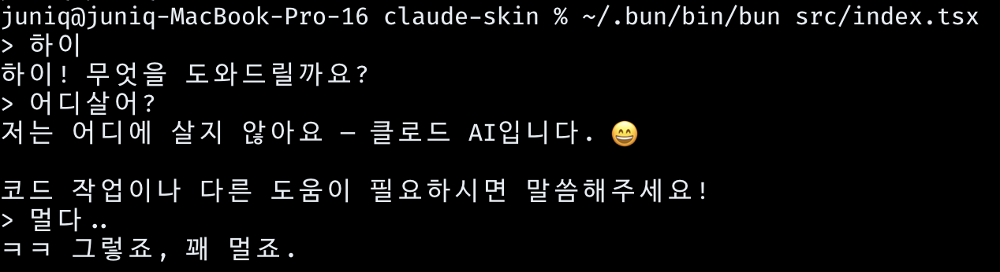

# claude-skin

Claude Code CLI의 터미널 UI를 자유롭게 커스터마이징하는 프로젝트. 수요 없는 공급.




## 왜 만드는가

- Claude Code의 터미널 UI는 고정되어 있어서 변경할 수 없음
- 테마, 레이아웃, 단축키 등을 내 취향에 맞게 바꾸고 싶음
- Claude CLI를 child process로 감싸고, React Ink로 UI를 직접 렌더링

## 핵심 아이디어

- Claude Code CLI를 child process로 실행
- `claude --print --output-format stream-json --input-format stream-json` (공식 플래그)
- stdin/stdout 파이프로 통신 → 기존 구독 요금 그대로 사용
- React Ink로 터미널 UI 렌더링 → UI 자유 커스터마이징

## stream-json 프로토콜

`claude --print --output-format stream-json --input-format stream-json`으로 실행하면 NDJSON(줄마다 JSON 하나)으로 통신한다.

### 입력 (stdin)

```json
{"type":"user","message":{"role":"user","content":"say just hello"}}
```

### 출력 (stdout) — 이벤트 순서

**1. system (init)** — 세션 시작

```json
{
  "type": "system",
  "subtype": "init",
  "session_id": "a09b7a70-...",
  "model": "claude-opus-4-6",
  "tools": ["Bash", "Edit", "Read", "Write", "..."],
  "mcp_servers": [],
  "permissionMode": "bypassPermissions",
  "claude_code_version": "2.1.38"
}
```

**2. stream_event (message_start)** — 응답 시작

```json
{
  "type": "stream_event",
  "event": {
    "type": "message_start",
    "message": {
      "model": "claude-opus-4-6",
      "id": "msg_01QZMq...",
      "role": "assistant",
      "content": [],
      "stop_reason": null,
      "usage": { "input_tokens": 3, "output_tokens": 1 }
    }
  },
  "session_id": "a09b7a70-..."
}
```

**3. stream_event (content_block_start)** — 콘텐츠 블록 시작

```json
{
  "type": "stream_event",
  "event": { "type": "content_block_start", "index": 0, "content_block": { "type": "text", "text": "" } }
}
```

**4. stream_event (content_block_delta)** — 실시간 토큰

```json
{
  "type": "stream_event",
  "event": { "type": "content_block_delta", "index": 0, "delta": { "type": "text_delta", "text": "hello" } }
}
```

**5. assistant** — 중간 스냅샷 (전체 content 포함)

```json
{
  "type": "assistant",
  "message": {
    "role": "assistant",
    "content": [{ "type": "text", "text": "hello" }],
    "stop_reason": null
  },
  "session_id": "a09b7a70-..."
}
```

**6. stream_event (content_block_stop / message_delta / message_stop)**

```json
{ "type": "stream_event", "event": { "type": "content_block_stop", "index": 0 } }
{ "type": "stream_event", "event": { "type": "message_delta", "delta": { "stop_reason": "end_turn" }, "usage": { "output_tokens": 4 } } }
{ "type": "stream_event", "event": { "type": "message_stop" } }
```

**7. result** — 최종 결과

```json
{
  "type": "result",
  "subtype": "success",
  "is_error": false,
  "result": "hello",
  "total_cost_usd": 0.053,
  "duration_ms": 2665,
  "num_turns": 1,
  "session_id": "a09b7a70-...",
  "modelUsage": {
    "claude-opus-4-6": { "inputTokens": 3, "outputTokens": 4, "costUSD": 0.053 }
  }
}
```

## 주의: --dangerously-skip-permissions

이 프로젝트는 `--dangerously-skip-permissions` 플래그로 Claude CLI를 실행한다. 모든 tool(파일 수정, 삭제, 웹 검색 등)이 **확인 없이 자동 실행**된다.

끄려면 `src/claude-process.ts`에서 `--dangerously-skip-permissions`를 제거하면 된다.

## Claude CLI 옵션

`src/claude-process.ts`의 spawn 인자에 추가해서 사용할 수 있다.

| 옵션 | 설명 |
|------|------|
| `--system-prompt <prompt>` | 시스템 프롬프트를 통째로 교체 |
| `--append-system-prompt <prompt>` | 기본 시스템 프롬프트에 추가 (말투/뉘앙스 커스터마이징에 적합) |
| `--model <model>` | 사용할 모델 지정 (예: `claude-sonnet-4-5-20250929`) |
| `--verbose` | 상세 출력 |
| `--include-partial-messages` | 스트리밍 중간 메시지 포함 |
| `--dangerously-skip-permissions` | 모든 tool 자동 승인 (주의) |

예시: 반말로 유머러스하게 응답하게 하려면

```ts
["claude", "--print", "--output-format", "stream-json", "--input-format", "stream-json",
 "--append-system-prompt", "반말로 대답해. 유머러스하게."]
```

## 기술 스택

- **Bun** - 런타임
- **React Ink** - 터미널 UI
- **TypeScript**

